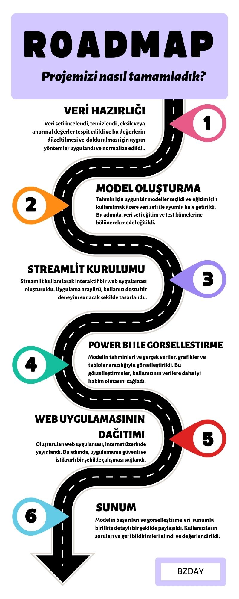

# Wind Energy Forecasting Project
This project is developed to make accurate and reliable predictions for wind energy production, which is crucial for optimizing renewable energy resources and ensuring sustainable energy supply. To achieve this goal, four distinct models have been employed: XGBoost, LSTM (Long Short-Term Memory), Prophet, and loadable LSTM. Each model offers unique capabilities and advantages, allowing for comprehensive analysis and prediction of wind energy generation patterns. By leveraging the strengths of these diverse models, this project aims to provide valuable insights into wind energy forecasting, facilitating better decision-making processes for energy stakeholders, policymakers, and environmental advocates.

## Description of Dataset
The dataset used in this project contains hourly observations related to wind energy production. Key variables include time, temperature, humidity, wind speed, and power production.

## Dataset Summary
The dataset represents a detailed hourly record since January 2, 2017. It is a compilation of meteorological observations collected from our operational fields and wind energy production data. It showcases the relationship between various weather conditions and wind energy production.

## Column Names and Descriptions
- **Temperature (temperature_2m)**: Represents air temperature in Celsius degrees.
- **Humidity (relativehumidity_2m)**: Represents air humidity as a percentage.
- **Wind Direction (winddirection_10m)**: Represents wind direction at 10 meters height in degrees.
- **Wind Gusts (windgusts_10m)**: Represents wind gusts at 10 meters height in meters per second.
- **Dewpoint (dewpoint_2m)**: Represents air dew point in Celsius degrees.
- **Wind Speed (windspeed_10m)**: Represents wind speed at 10 meters height in meters per second.
- **Power Production (Power)**: Represents wind energy production in MW.
- **Location**: Represents the location where the measurement is taken.

# Introduction to Models

## XGBoost Model
XGBoost is a type of Gradient Boosting algorithm. This model is used to model complex relationships and make predictions. It is a suitable choice to consider various variables like weather conditions in wind energy prediction.
### Training and Testing Data Comparisons For Prophet

## LSTM Model
LSTM (Long Short-Term Memory) is a frequently used deep learning model for modeling sequential data like time series. In this project, the LSTM model has been adapted to make wind energy predictions using time and power columns. Additionally, users can upload their own data and add customized LSTM models for flexibility.

### Training and Testing Data Comparisons For LSTM

## Data loadable LSTM model
### Training and testing data comparisons for Data loadable LSTM model

## Prophet Model
Prophet is a time series forecasting tool developed by Facebook. It automatically handles seasonality, holiday effects, and trends. Due to these features, Prophet model is a simple and effective option for wind energy prediction.
### Training and Testing Data Comparisons For Prophet

# Roadmap

# Streamlit 
👉 https://forecast-wind-energy.streamlit.app/

## Usage
1. Clone the project: `git clone https://github.com/your-username/wind-energy-forecast.git`
2. Install necessary libraries: `pip install -r requirements.txt`
3. Run the model: `python main.py`

